# GenAI Backend Skeleton (FastAPI)

**Status:** ✅ Completed (Portfolio Project)  
**Last updated:** 2026-01-30  
**Next:** FinGenAI Backend Skeleton (v2) — new repo (link coming soon)

A production-style FastAPI backend template demonstrating end-to-end backend delivery:
auth, ownership + multi-tenant org/workspaces, RBAC, migrations, tests + CI, Docker, deploy, observability, and abuse controls.

### What this project includes
- **Auth:** JWT login + protected routes
- **Data:** SQLAlchemy models + Alembic migrations
- **Tenancy:** Organizations + memberships + workspaces (org-scoped access)
- **RBAC:** OWNER / ADMIN / MEMBER enforcement (example: workspace creation restricted)
- **Reliability:** rate limiting + daily quota
- **Observability:** request_id middleware + structured logs + safe 500 errors
- **Quality:** pytest coverage + GitHub Actions CI + Docker + live Render deployment

## Proof (Swagger screenshots)

## CI (GitHub Actions)

- CI running pytest on every push:
  - proof/ci/github-actions-ci-success.png

## Quickstart (Local)

### 1) Create env + install deps

```bash
conda create -n ai python=3.11 -y
conda activate ai
...
pip install ...

pip install -r requirements.txt
pip install -r requirements-dev.txt
```

### 2) Create `.env`
```bash
cp .env.example .env
# edit JWT_SECRET_KEY if needed
```

### 3) Run migrations
```bash
alembic upgrade head
```

### 4) Run the server
```bash
uvicorn app.main:app --reload
```
## Quickstart (Docker)
### 1) Build + run
```bash
```
docker compose up --build

## Live Demo (Render)

- **Base URL:** [genai-backend-skeleton.onrender.com](https://genai-backend-skeleton.onrender.com)
- **Health:** [/health](https://genai-backend-skeleton.onrender.com/health)
- **Docs:** [/docs](https://genai-backend-skeleton.onrender.com/docs)

Proof:
- [Live / (root)](proof/deploy/live-root.png) 
- [Live /health](proof/deploy/live-health.png)
- [Live /docs](proof/deploy/live-docs.png)

### Database + CRUD

- CRUD + cleanup:
  - proof/database-migrations/swagger-get-notes-cleanup.png
  - proof/database-migrations/swagger-post-note-ok-cleanup.png
  - proof/database-migrations/swagger-put-note-ok-cleanup.png

- GET /notes/{id} returns 404 when missing:
  - proof/database-migrations/swagger-get-note-404-not-found.png

### Pagination

- Pagination:
  - proof/database-migrations/swagger-get-notes-pagination.png
  - proof/database-migrations/swagger-get-notes-pagination-offset-4.png

## Observability proof (request_id + safe errors)

- Request ID header on responses (/health):
  - proof/observability/swagger-health-200-request-id.png

- Standard 500 error response includes request_id:
  - proof/observability/swagger-500-standard-error-shape.png
  - proof/observability/swagger-500-error-with-request-id.png

- Verified test endpoint removed (/boom returns 404):
  - proof/observability/swagger-boom-404-after-delete.png

- Pagination validation (limit bounds):
  - proof/observability/swagger-get-notes-limit-validation.png

- 500 test seen + query restored (back to 200):
  - proof/observability/swagger-get-notes-restored-200.png

- GET /notes/{id} 404 includes request_id:
  - proof/observability/swagger-get-note-404-request-id.png

- Render logs show request duration + request_id:
  - proof/observability/render-request-log-duration-request-id.png

- Rate limiting returns 429:
- proof/observability/swagger-health-429-rate-limit.png

- API versioning uses /api/v1:
  - proof/observability/swagger-api-v1-endpoints.png

- Quota returns 429 when daily limit exceeded:
  - proof/observability/swagger-notes-429-quota.png

- Latest GitHub Actions run is green: 
  - proof/observability/actions-green.png
## Auth proof (JWT + protected routes)

- Signup works:
  - proof/auth/users-post-success.png

- Login returns access_token:
  - proof/auth/auth-login-success.png

- Protected notes:
  - Missing token → 401:
    - proof/notes/notes-missing-token-401.png
  - With token → 200:
    - proof/notes/notes-get-success-with-token.png

## Tests proof (pytest)

- All tests passing:
  - proof/tests/pytest-7-passed.png

## Docker proof (compose)

- docker compose build + up:
  - proof/docker/docker-compose-up-build.png

- /health works inside container:
  - proof/docker/docker-health.png

- Docker Desktop shows container running:
  - proof/docker/docker-desktop-containers-running.png

## Proof (Swagger screenshots)

### Auth
- 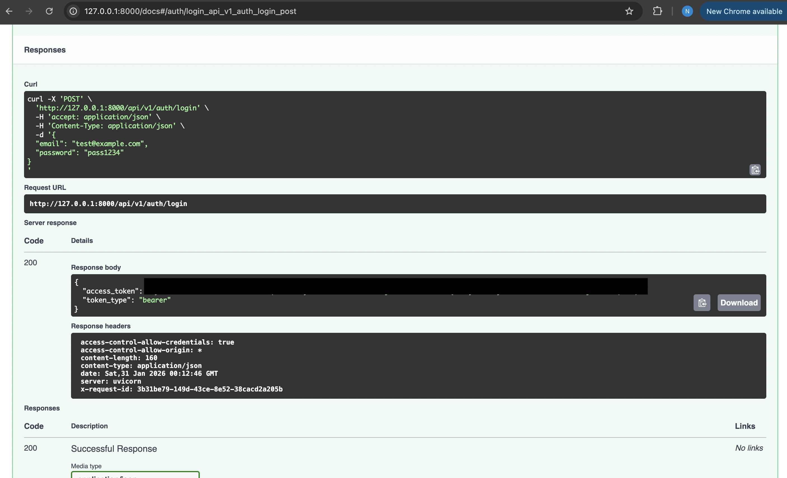
- 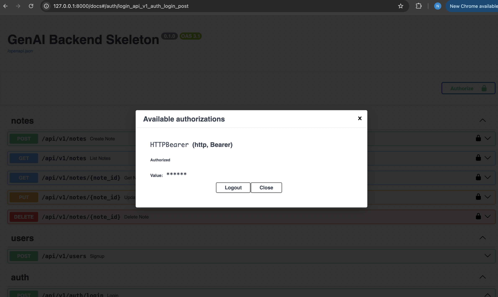

### Database migrations
- 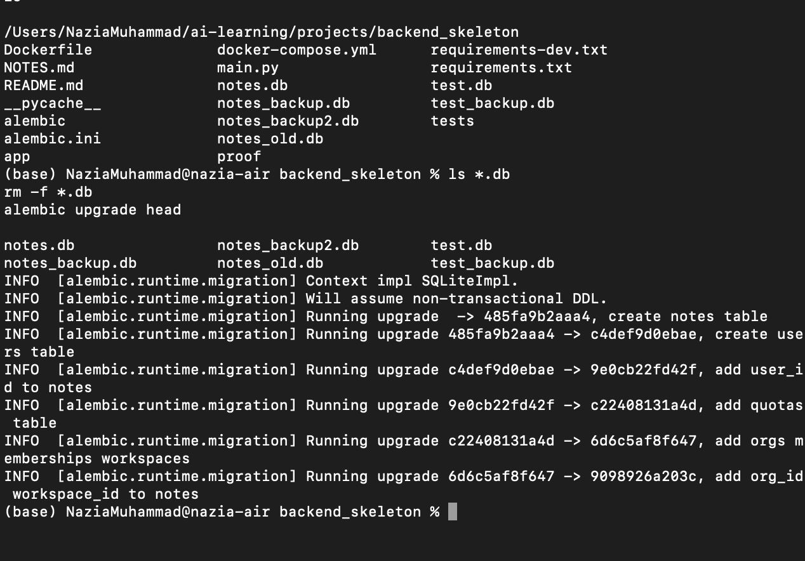

### Tenancy (org scoping)
- 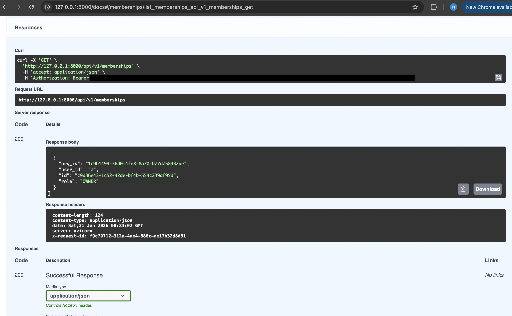
- 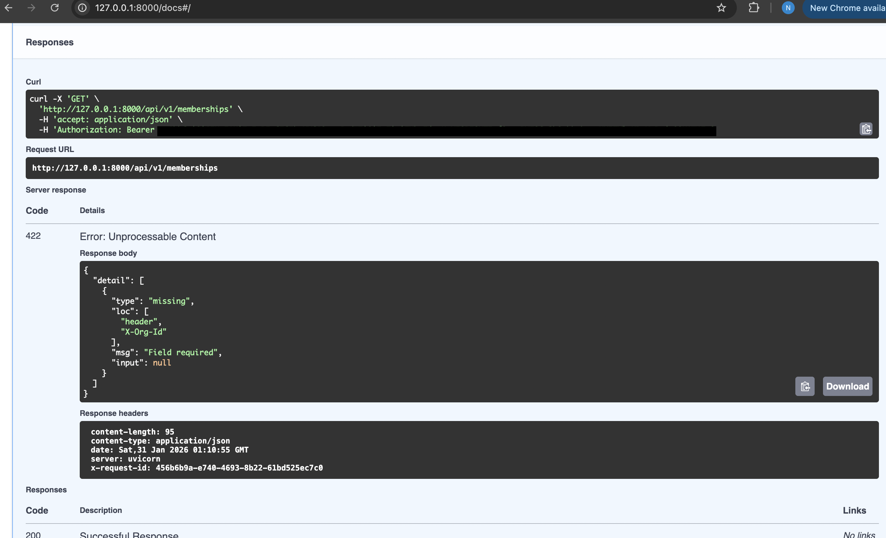
- 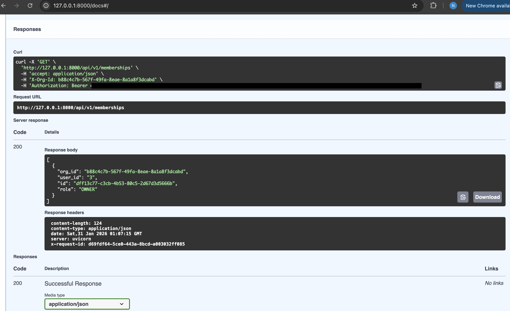
- 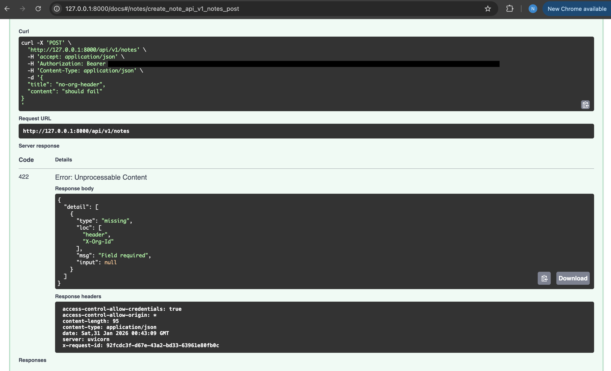
- 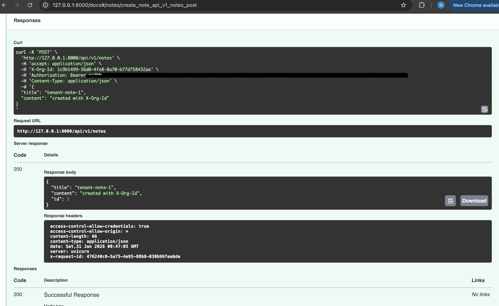
- 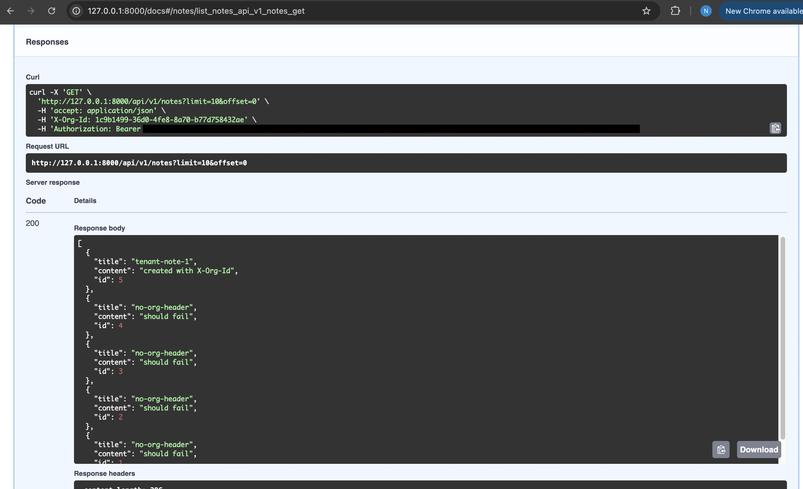
- 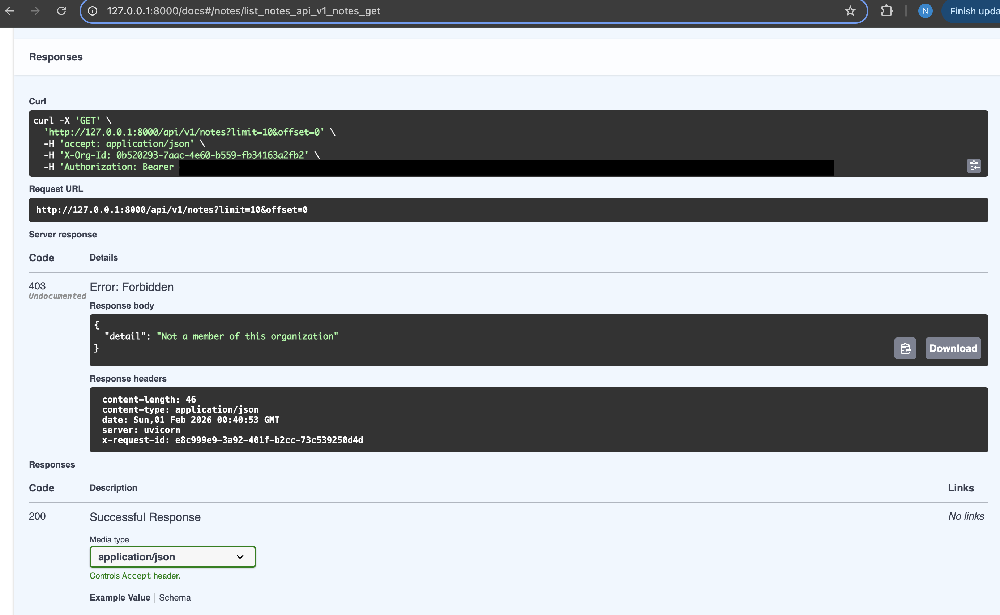
- 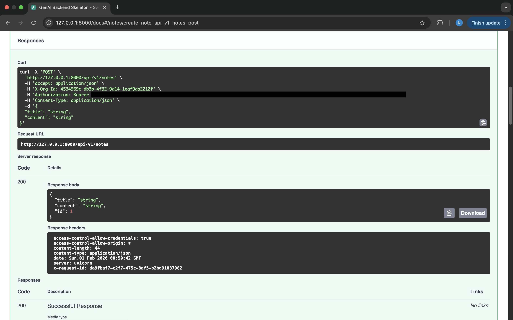

### Observability
- 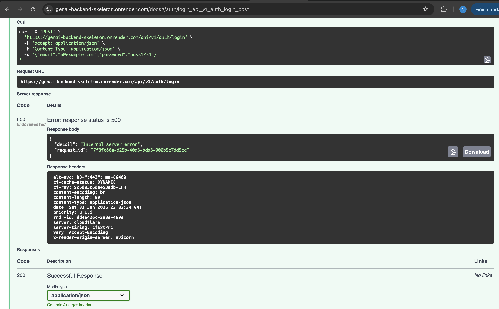

### Tests
- 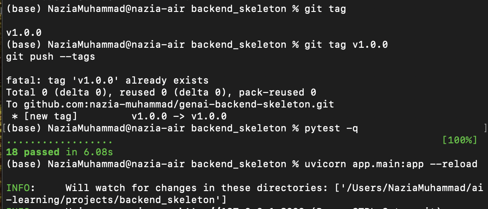
